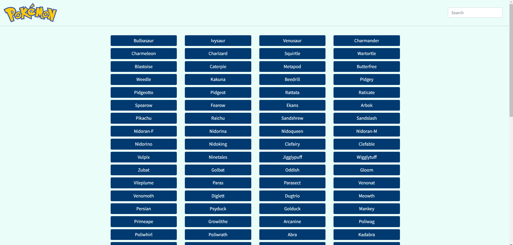

# Pokemon App

## About
This is a Pokédex App built with HTML, CSS and Javascript that loads data from an external API and enables the viewing of data points in detail. When a Pokemon is clicked, the image, height, weight and type characteristics of the Pokemon appears on a modal. Alternatively, pokemons can be searched by typing the pokemon name in the search bar. This modal can then be closed by clicking on the close (x) button, pressing the escape key or clicking outside the modal.

## App dependencies
- jQuery
- Bootstrap
- Pokémon API
- Ajax

#### Autor
[GitHub](https://github.com/Dj2035)
